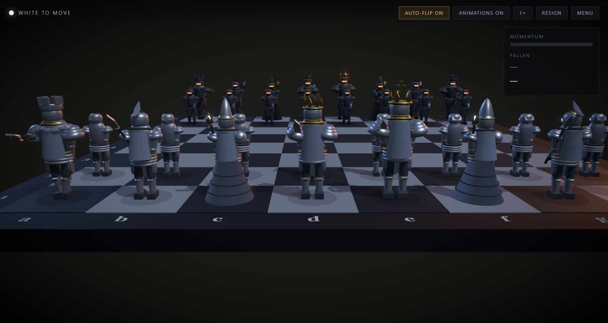
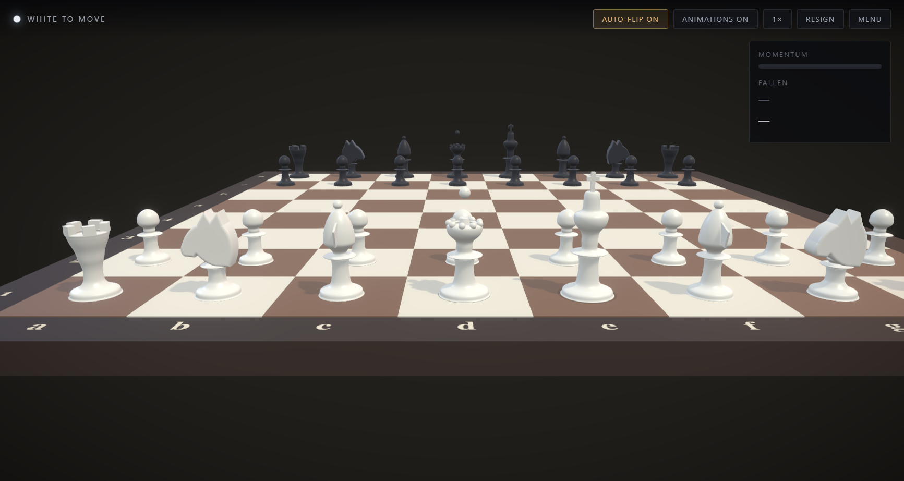
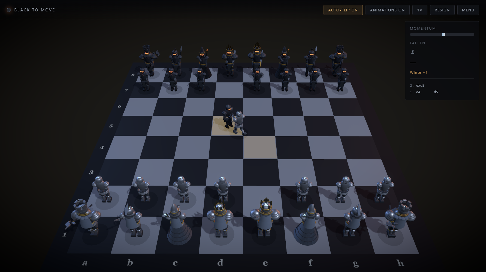
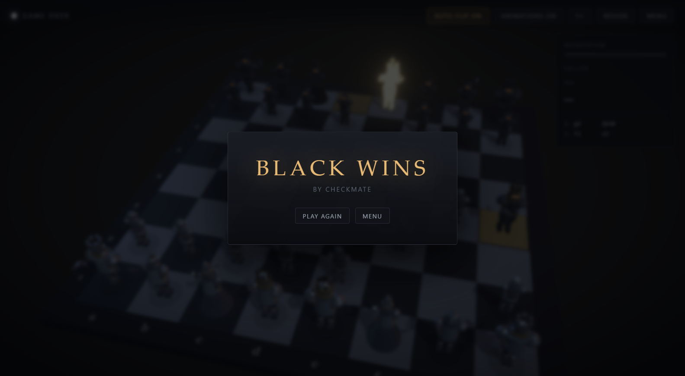

# Chess — Dark Fantasy 3D Chess

A desktop chess game with two visual themes over one rules engine: a clean **Classical** Staunton set, and an **Animated** theme where armoured characters walk to their squares, duel when they capture, and blaze with light when the game turns.

Built with Electron, TypeScript, React and three.js. Plays hotseat or against a built-in engine.



---

## Features

- **Two themes over one engine.** Classical is fast and low-spec; Animated runs the full duel and aura system. Switch between them without touching game logic.
- **Two modes.** Man vs Man (hotseat) and Man vs Machine.
- **Capture duels.** The attacker walks up, strikes, and the victim's death animation is triggered on the attacker's exact hit frame — with impact sound and camera shake on the same frame.
- **Piece-specific movement.** The knight *leaps* its L-shape, the rook strides, the bishop glides, the king shuffles.
- **Auras.** A subtle ambient glow tracks material advantage, the checked king pulses red, and the winning king raises his sword in a burst of gold.
- **Hotseat board flip.** In Man vs Man the camera swings round to whoever is to move, so both players read the board from their own side.
- **Laddered AI.** Five difficulty rungs from *Squire* to *Sovereign*, all returning a move in under two seconds.
- **Full rules.** Castling, en passant, promotion, stalemate, threefold repetition, insufficient material.
- **Zero external assets.** Every 3D object is generated in code and every sound is synthesised at runtime. Nothing downloads, and the app works fully offline.

---

## Quick start

Requires **Node 20+** on Windows, macOS or Linux.

```bash
git clone <your-repo-url>
cd Chess
npm install
npm run dev
```

To produce a Windows installer:

```bash
npm run dist     # NSIS installer into release/
```

---

## Screenshots

| Classical | Capture duel |
|---|---|
|  |  |



---

## Architecture

One rule shapes the whole codebase:

> **Game logic and presentation are completely separate.** A move is committed to the rules model instantly and authoritatively. The 3D layer then *replays* it from a queue of `Cinematic` objects while input is locked.

```
Input ──▶ GameStore (FSM) ──▶ Rules.move()   ← instant, authoritative
               │
               └──▶ Cinematic queue ──▶ Director ──▶ Theme renders it
                                            │
                                            └──▶ onComplete → unlock input
```

Holding that line is why skip-animation, theme switching, board flipping and headless testing are all cheap — and it means `src/renderer/core/` runs in plain Node with no browser, no three.js and no React, so the entire game model is unit-testable.

### Layer boundaries

| Directory | May import | Must never import |
|---|---|---|
| `core/` | chess.js, zustand/vanilla | three.js, React, `scene/`, `ui/` |
| `scene/` | three.js, r3f, `core/` | `ui/` components |
| `ui/` | React, `core/` | three.js |

### Project layout

```
src/
├─ main/                     Electron main process
├─ preload/
└─ renderer/
   ├─ core/                  ── PURE: no three.js, no React ──
   │  ├─ rules.ts            chess.js wrapper + stable piece identity
   │  ├─ gameStore.ts        the turn/animation state machine
   │  └─ engine/             negamax AI in a Web Worker
   ├─ scene/
   │  ├─ geometry/           procedural Staunton set + armoured characters
   │  └─ animation/          cinematic director, poses, motion registry
   ├─ ui/                    React menus and HUD
   └─ audio/                 Web Audio synthesis
tests/                       vitest — rules and engine
doc/PROJECT_PLAN.md          full plan, rationale and progress log
```

### Two details worth calling out

**Stable piece identity.** chess.js thinks in squares; a 3D scene thinks in objects. `core/rules.ts` maintains an identity map so the scene knows the knight now on f3 is the same knight that was on g1 — and so a captured piece can play its death animation while the board model has already moved on.

**En passant is a first-class case.** The `capture` cinematic carries an explicit `victimSquare`, because en passant takes a pawn that is *not* on the destination square. It's the case animated chess games get wrong most often, so it's in the type and in the test suite.

---

## Tech stack

| Layer | Choice |
|---|---|
| Shell | Electron 38 + electron-builder |
| Language | TypeScript 5.9 (strict) |
| UI | React 19 + Vite 7 |
| 3D | three.js 0.180 via @react-three/fiber + drei |
| Post FX | @react-three/postprocessing (bloom, vignette, SMAA) |
| Rules | chess.js 1.4 |
| AI | Built-in negamax in a Web Worker |
| State | Zustand (vanilla store) |
| Audio | Web Audio API |
| Tests | Vitest |

---

## Scripts

```bash
npm run dev         # electron-vite dev with HMR
npm test            # vitest — rules and engine
npm run typecheck   # tsc --noEmit
npm run build       # bundle main + preload + renderer
npm run dist        # Windows NSIS installer
```

---

## Testing

33 unit tests cover the rules layer (piece identity, all special moves, terminal
positions) and the engine (evaluation, mate-finding, legality, time budgets).

```bash
npm test
```

The 3D layer is verified separately by driving the built app through Electron and
asserting on real game state — engine replies, checkmate detection, promotion,
and camera position across board flips.

---

## Status

Playable end to end. See [doc/PROJECT_PLAN.md](doc/PROJECT_PLAN.md) for the full plan and progress log.

Three things are deliberate placeholders, each behind a seam that makes swapping them a contained change:

- **The animated characters are procedural**, not sculpted models. They're built from code to the concept art's silhouettes so the whole animation pipeline could be built and tuned before any modelling work. Replacing them means swapping one function for a glTF loader.
- **The AI is a built-in negamax search** (alpha-beta, quiescence, piece-square tables, iterative deepening), not Stockfish — so the game runs with no asset download. `ChessEngine` is the interface to drop Stockfish in behind.
- **Audio is synthesised**, not sampled. No binary audio assets.

Not yet built: clocks, undo/takeback, saved games, online play.

---

## Credits

Character concept art by **Miguel** (dated Jan–Feb 2023). Every armoured design in
the Animated theme — the crenellated rook helm, the bishop's mitre and robe, the
knight's plume, the king's throne — is derived from those sketches.

---

## License

All rights reserved. This repository is published for viewing; it does not grant a
licence to reuse the code or the artwork. The concept art is the property of its
author and is not covered by any licence granted here.
